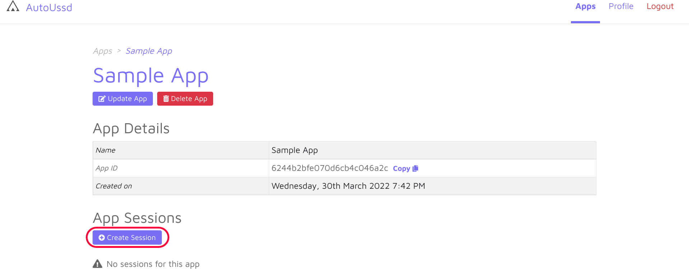
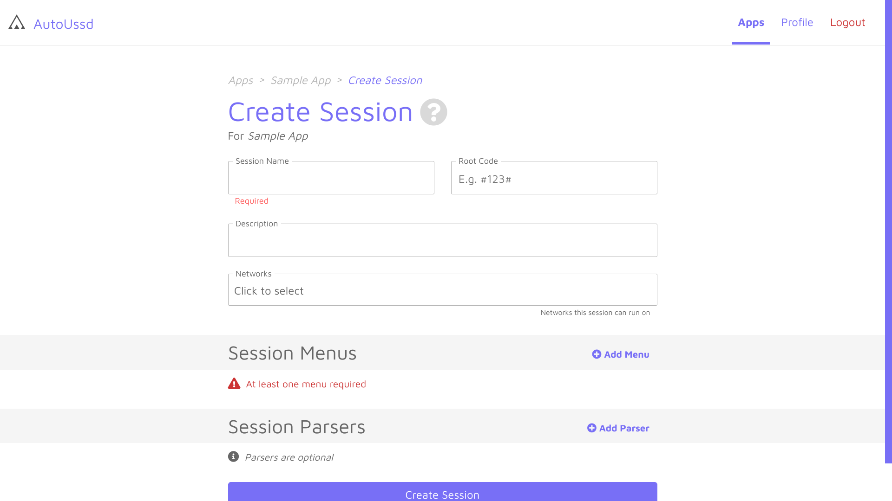

[Home](./README.md)

# Sessions

A session is a sequence of USSD menus you would go through to complete a certain transaction on your phone (E.g. **money transfer**, **airtime purchase** and **internet bundle purchase**). An example is shown below. This is the sequence of menus for Vodafone mobile money transfer:

# Components of a session

A session consists of six (6) components which are described below:

| Component     | Description                                          | Example                                                  |
| ------------- | ---------------------------------------------------- | -------------------------------------------------------- |
| `Name`        | A name to identify this session in your session list | *Vodafone money transfer*                                |
| `Root Code`   | The USSD code which initiates this session           | **110#*                                                  |
| `Description` | A brief description of this session                  |                                                          |
| `Networks`    | A list of networks which can execute this session    | *MTN (Ghana)* , *Vodafone (Ghana)*, *AirtelTigo (Ghana)* |
| `Menus`       | A list of menus which define this session            |                                                          |
| `Parsers`     | An optional list of parsers for this session         |                                                          |

# Create a session

1. Create or open an existing app in your dashboard
2. Click on the **Add Session** button
3. Fill the session form, add your [menus](./03.Menus.md) and [parsers](./04.Parsers.md) (optional)
4. Click the **Create Session** button

# Conclusion

Awesome. You've created your very first session. In the guides section, we'll use this sessions to build a sample Android app.

---

Back: [Terminology](./01.Terminology.md)    Next Up: [Menus](./03.Menus.md)
