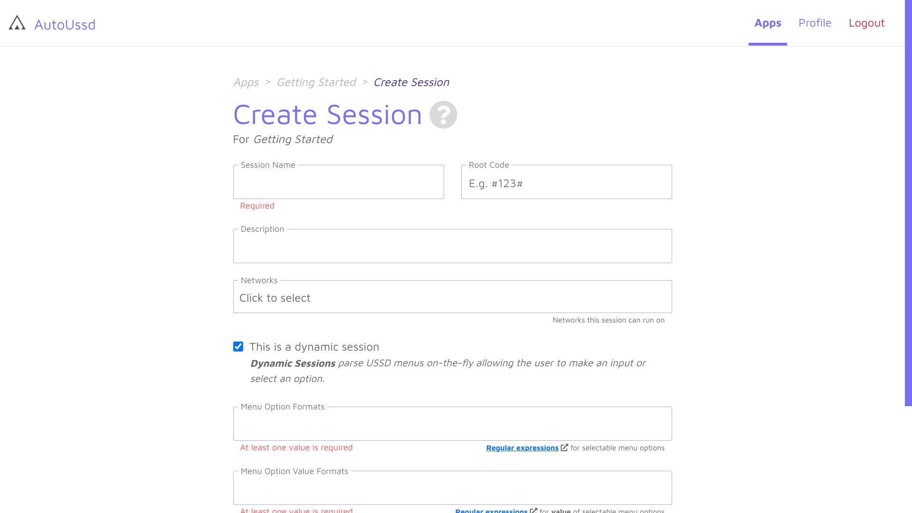

[Home](./README.md)

# Sessions

A session is a sequence of USSD menus you would go through to complete a certain transaction on your phone (E.g. **money transfer**, **airtime purchase** and **internet bundle purchase**). An example is shown below. This is the sequence of menus for Vodafone mobile money transfer:

## Types of sessions

AutoUssd supports two (2) types of sessions:

1. Regular Sessions
2. Dynamic Sessions

### 1. Regular Sessions

Regular sessions allow you to specify the exact steps to the SDK should take to interact with a USSD service. These steps consist of instructions like "*Enter 1 and Press Ok*" or "*Cancel Operation*".

A regular session has six (6) components which are described below:

| Component     | Description                                                  | Example                                                  |
| ------------- | ------------------------------------------------------------ | -------------------------------------------------------- |
| `Name`        | A name to identify this session in your session list         | *Vodafone money transfer*                                |
| `Root Code`   | The USSD code which initiates this session                   | **110#*                                                  |
| `Description` | A brief description of this session                          |                                                          |
| `Networks`    | A list of networks which can execute this session            | *MTN (Ghana)* , *Vodafone (Ghana)*, *AirtelTigo (Ghana)* |
| `Menus`       | A list of [menus](./03.Menus.md) which define the steps for this session |                                                          |
| `Parsers`     | An optional list of [parsers](./04.Parsers.md) for this session |                                                          |

### 2. Dynamic Sessions - *New in v4*

Dynamic sessions instruct the SDK to behave like traditional USSD. When a new USSD dialog is ready, the SDK inspects its text content and generates **highly customizable UI** equivalent and displays that to the user. The SDK then waits for the user to make an input before continuing.

A dynamic session has seven (7) components which are described below:

| Component              | Description                                                  | Example                                                  |
| ---------------------- | ------------------------------------------------------------ | -------------------------------------------------------- |
| `Name`                 | A name to identify this session in your session list         | *Vodafone money transfer*                                |
| `Root Code`            | The USSD code which initiates this session                   | **110#*                                                  |
| `Description`          | A brief description of this session                          |                                                          |
| `Networks`             | A list of networks which can execute this session            | *MTN (Ghana)* , *Vodafone (Ghana)*, *AirtelTigo (Ghana)* |
| `Option Formats`       | A list of [**regular expressions**](https://developer.mozilla.org/en-US/docs/Web/JavaScript/Guide/Regular_Expressions) that define how options look like in the USSD dialogs | `^\d+\.?( +)?\w+`                                        |
| `Option Value Formats` | A list of [**regular expressions**](https://developer.mozilla.org/en-US/docs/Web/JavaScript/Guide/Regular_Expressions) that extract the value of an option in the USSD.  E.g. If we have an option *1. Send Money*, the value of this option is **1**. To extract this **1** from the option, we would use the regular expression `^\d+`. | `^\d+`                                                   |
| `Timeout`              | The number of seconds the SDK should wait for before a timeout occurs. A timeout occurs when the user has not made an input in a certain period of time |                                                          |

## Create a session

1. Create or open an existing app in your dashboard
2. Click on the **Add Session** button
3. Fill the session form, add your [menus](./03.Menus.md) and optional [parsers](./04.Parsers.md) (optional) or *option formats* and *option value formats*.
4. Click the **Create Session** button

<i>Regular Session</i>

<i>Dynamic Session</i>

## Conclusion

Awesome. You've created your very first session. In the guides section, we'll use this session to build a sample Android app.

---

Back: [Terminology](./01.Terminology.md)    Next Up: [Menus](./03.Menus.md)
