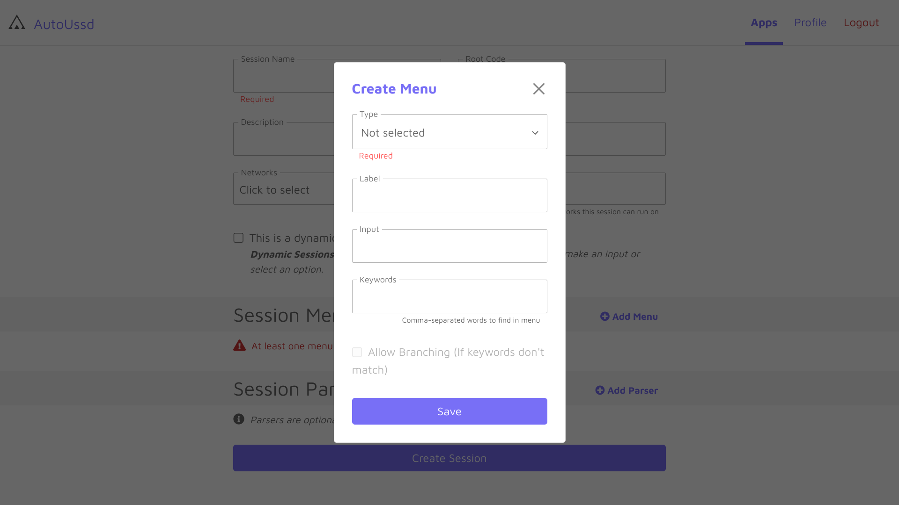

[Home](./README.md)

# Menus

A menu is simply a part of a [session](./02.Sessions.md). When going through a USSD sequence, each prompt that comes up is what we call the menu. An example is shown below. This is the first menu from the Vodafone mobile money menu when you dial ***110#**.

# Components of a menu

A menu consists of five (5) components which are described below:

| Component  | Description                                                  | Example                                             |
| ---------- | ------------------------------------------------------------ | --------------------------------------------------- |
| `Type`     | Indicates the type of menu. This can be one of the following:  1. **Value** - Menu requires an input which you specify in your dashboard 2. **Variable** - Menu requires an input which will be supplied atr runtime in your Android app 3. **PIN** - Menu requires a PIN. The SDK will ask the user to enter his/her PIN at runtime. 4. **Button** - Menu only requires a button to be pressed. You specify the text of the button to be pressed. |                                                     |
| `Label`    | A short name for this menu                                   | *Main menu*                                         |
| `Keywords` | An optional comma-separated list of keywords to look out for in the menu text.  If this is specified, all keywords **must all be present** in the menu else the SDK will terminate with a `MENU_CONTENT_MISMATCH` error. | *Send, withdraw, airtime, data, financial, account* |
| `Input`    | Indicates the text the SDK should enter for this menu, or the text of the button which the SDK should press. This only applies to *Value* and *Button* type menus. | *Send*, *Cancel*                                    |

# Create a menu

1. Click on the **Add menu** button
2. Fill the form with the menu details
3. Click the **Save** button to add the menu to your session

# Conclusion

Awesome. You've created your first menu within your session.

---

Back: [Sessions](./02.Sessions.md)    Next Up: [SMS Parsers](./04.Parsers.md)

