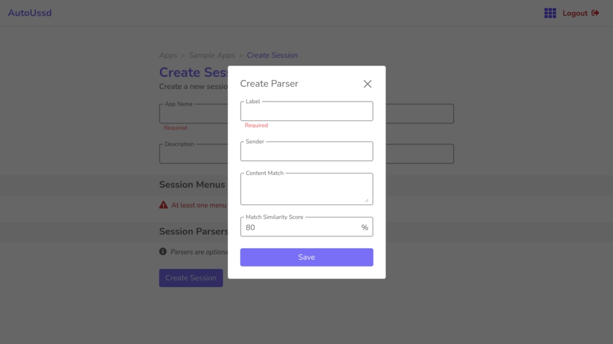

[Home](./README.md)

# SMS Parsers

You may have noticed that when you use some USSD applications, an SMS message is sent afterward to notify you if whatever you did was successful, or it failed.

An example is sending money via mobile money. You’ll usually receive an SMS stating if the transaction was success or it failed for some reason. (E.g. Wrong PIN, Insufficient Balance, etc.)

For the SDK to be able to deal with such a scenario, you can add one or more SMS parsers (referred to as just parsers from now) to your session in your dashboard.

When you add parsers to your session, the SDK doesn’t immediately notify your app when a session is completed. It will wait for an incoming SMS whose content matches the parser before invoking the callback to notify your app.

# Components of a parser

A parser structure is similar to that of a [menu](./03.Menus.md) because they both perform a similar function. You can think of a menu as a parser but for USSD content instead of SMS messages.

| Component                | Description                                                  | Example                              |
| ------------------------ | ------------------------------------------------------------ | ------------------------------------ |
| `Label`                  | A short name for this parser                                 | *Success parser*, *Wrong PIN parser* |
| `Sender`                 | The sender of the SMS message                                | *VF-CASH*                            |
| `Content match`          | The content of the SMS message  *0000000000000000 Confirmed. GHSxxx.yy sent **to** 024xxxyyyy John Doe **on** MTN MOBILE MONEY **on** 2021-05-23 at 21:05:04. You were charged GHS0.00. Your Vodafone Cash balance is GHS xxx.yy. Reference: Test.*  **WARNING**: You should replace sensitive information here with dummy text as done in the example above. |                                      |
| `Match similarity score` | The level of similarity between the **Content match** and the **SMS text**.  For each SMS message received from the sender, the SDK calculates a similarity score (0–100%) between the SMS message text and the **Content match** for that menu.  If this calculated similarity score is greater than or equal to the **Match similarity score** defined here, the parser is set as the matching parser. | *80%*                                |

# Create a parser

1. Click on the **Add parser** button
2. Fill the form with the parser details
3. Click the **Save** button to add the parser to your session

# Conclusion

Awesome. You've created your first parser within your session. You’re now familiar with the following concepts:

1. [Terminology](./01.Terminology.md)
2. [Sessions](./02.Sessions.md)
3. [Menus](./03.Menus.md)
4. Parsers

So we're now ready to start [building a sample Android](./05.Build-Sample-App-Setup.md) app which utilizes a session to do useful work! 

---

Back: [Menus](./03.Menus.md)    Next Up: [Build a Sample App - Setup](./05.Build-Sample-App-Setup.md)

