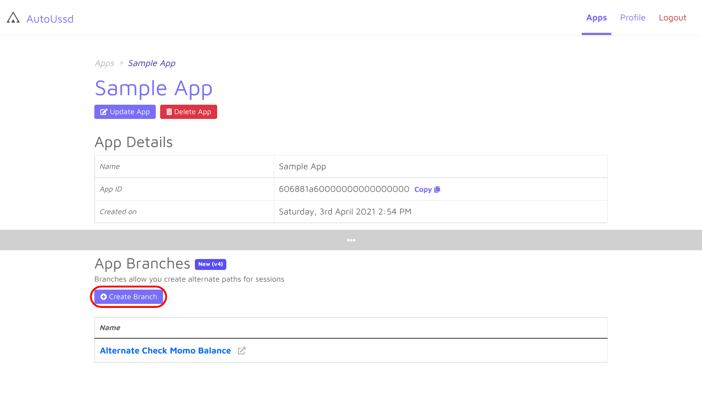
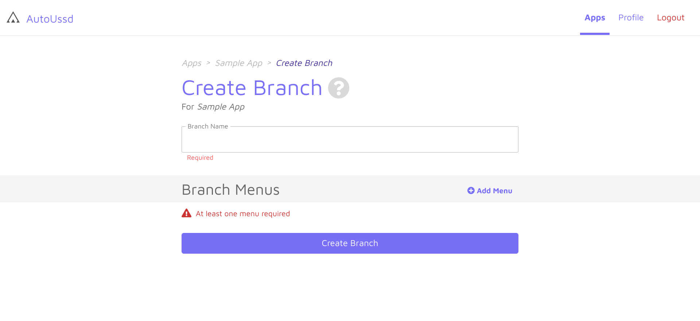

[Home](./README.md)

# Branches

A branch is an alternate sequence of USSD menus that a session can use. Why is
this necessary?

In some USSD services, you'd notice that, depending on the user, there might be
different or additional menus. Branches allow you to correctly, model this
behavior.

*You can think of branches as mini-sessions than can be augmented into other
sessions*.

## Components of a branch

A branch consists of two (2) components which are described below:

| Component | Description                                               |
| --------- | --------------------------------------------------------- |
| `Name`    | A name to identify this session in your session list      |
| `Menus`   | A list of [menus](./03.Menus.md) which define this branch |

## Create a branch

1. Create or open an existing app in your dashboard
2. Scroll to the "App Branches" section
3. Click on the **Add Branch** button
4. Fill the branch form and add your [menus](./03.Menus.md)
5. Click the **Create Branch** button

## Conclusion

Awesome. You've created your very first branch in your app. You’re now familiar
with the following concepts:

1. [Terminology](./01.Terminology.md)
2. [Sessions](./02.Sessions.md)
3. [Menus](./03.Menus.md)
4. [Parsers](04.Parsers.md)
5. Branches

So we're now ready to
start [building a sample Android](./06.Build-Sample-App-Setup.md) app which
utilizes a session to do useful work!

---

Back: [Parsers](./04.Parsers.md)    Next
Up: [Build a Sample App - Setup](./06.Build-Sample-App-Setup.md)
