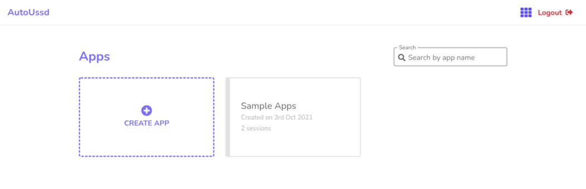

[Home](./README.md)

# Build A Sample App - Setup

In this guide, we'll setup a session for a Vodafone-to-Vodafone mobile money transfer. You can modify the steps to fit your desired mobile money provider’s flow (Eg. MTN, AirtelTigo, Glo, etc).

For money transfer from Vodafone to Vodafone, our session would look like the image below:

As illustrated above:

1. We dial ***110#** to initiate the session.
2. We enter “**1**” to select “**Send Money**”
3. We enter “**1**” to select “**Vodafone Network**”
4. We enter “**1**” to select “**To enter recipient number**”
5. We enter the “**Recipient phone number**”
6. We enter the “**Amount**”
7. We enter the “**Reference**”
8. Finally, we enter our PIN to complete the transaction

# Create an App

1. [**Signup or Log into**](https://autoussd.com/) your AutoUssd dashboard
2. Click on the **Create App** button
3. Give your app a name and click on the **Create App** button
4. You should now see your new app within your app list.

# Create a Session

We’ll create a [session](./02.Sessions.md) with a *name* of “**Send Money**” and a *root code* of ***110#**.

# Add Menus To Session

Now let’s add the corresponding [menus](./03.Menus.md) to our session. Our first menu will have the following details:

| Field                    | Value                                                        |
| ------------------------ | ------------------------------------------------------------ |
| `Type`                   | *Value*                                                      |
| `Label`                  | *Main menu*                                                  |
| `Content Match`          | 1 Send Money 2 Withdraw Cash 3 Buy Airtime or Data 4 Make Payments 5 Financial Services 6 My account |
| `Input`                  | *1*                                                          |
| `Match similarity score` | *80%*                                                        |

Let's talk about what we've done here

- We are creating a **Value**-*type* menu with a *label* of **Main menu**
- In this menu, we are instructing the SDK to enter a *value* of **1** into the USSD menu on the Android device
- In the *content match*, we’ve entered content of the USSD menu and set the *match similarity score* to **80%**. This means the SDK will compare the *content match* here to that of the text of the USSD menu. If the similarity score is **80%** or more, then the USSD menu is valid and the SDK should process the next USSD menu.

Now that we’ve seen the process of configuring a menu. We’ll do same for the rest. For your convenience, we’ve compiled the USSD configuration of all the menus in the table below. You can just **copy and paste** into your menu dialog and proceed.

| Type       | Label             | Input/Button Text | Match Content                                                | Similarity |
| ---------- | ----------------- | ----------------- | ------------------------------------------------------------ | ---------- |
| `Value`    | *Main menu*       | *1*               | *1 Send Money 2 Withdraw Cash 3 Buy Airtime or Data 4 Make Payments 5 Financial Services 6 My account* | *80%*      |
| `Value`    | *Send money*      | *1*               | *Send Money 1 Vodafone Network 2 Other Networks 3 To Unregistered 4 To Bank Account 5 E-zwich 6 From Linked Bank Account 0 Back* | *80%*      |
| `Value`    | *Choose receiver* | *1*               | *Choose the receiver 1 To Enter recipient number 2. My List 0 Return to Main Menu* | *80%*      |
| `Variable` | *Enter number*    |                   | *Enter recipient phone number*                               | *80%*      |
| `Variable` | *Enter amount*    |                   | *Enter Amount*                                               | *80%*      |
| `Variable` | *Enter reference* |                   | *Enter Reference*                                            | *80%*      |
| `PIN`      | *Enter PIN*       |                   | *Send GHSX to XXXXXXXXXX - John Doe Fee is GHSX.XX Enter PIN to Complete or 1 to Cancel* | *70%*      |
| `Button`   | *Confirmation*    | *OK*              | *Your request is being processed. Please wait for the confirmation short message* | *80%*      |

# Conclusion

Awesome work 🎉🎉🎉! We’ve successfully setup our **app** and a **session** which transfers money from one Vodafone account to another.

In the next guide, we’ll create a simple app which executes this session on a real device. 

See you there!

---

Back: [SMS Parsers](./04.Parsers.md)    Next Up: [Build a Sample App - Platforms](./06.Build-Sample-App-Platforms.md)
