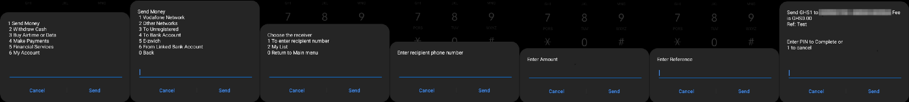
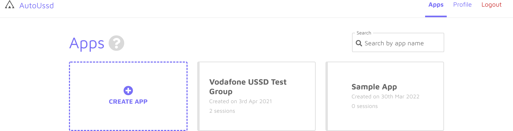

[Home](./README.md)

# Build A Sample App - Setup

In this guide, we'll setup a session for a Vodafone-to-Vodafone mobile money
transfer. You can modify the steps to fit your desired mobile network's flow (
Eg. MTN, AirtelTigo, Glo, etc).

For money transfer from Vodafone to Vodafone, our session would look like the
image below:

As illustrated above:

1. We dial ***110#** to initiate the session.
2. We enter “**1**” to select “**Send Money**”
3. We enter “**1**” to select “**Vodafone Network**”
4. We enter “**1**” to select “**To enter recipient number**”
5. We enter the “**Recipient phone number**”
6. We enter the “**Amount**”
7. We enter the “**Reference**”
8. Finally, we enter our PIN to complete the transaction

## Create an app

1. [**Signup or log into**](https://autoussd.com/) your AutoUssd dashboard
2. Click on the **Create App** button
3. Give your app a name and click on the **Create App** button
4. You should now see your new app within your app list.

## Create a session

We’ll create a [session](./02.Sessions.md) with a *name* of “**Send Money**” and
a *root code* of ***110#**.

## Add menus to the session

Now let’s add the corresponding [menus](./03.Menus.md) to our session. Our first
menu will have the following details:

| Field   | Value       |
| ------- | ----------- |
| `Type`  | *Value*     |
| `Label` | *Main menu* |
| `Input` | *1*         |

Let's talk about what we've done here

- We are creating a **Value**-*type* menu with a *label* of **Main menu**
- In this menu, we are instructing the SDK to enter a *value* of **1** into the
  USSD menu on the Android device

Now that we’ve seen the process of configuring a menu. We’ll do same for the
rest. For your convenience, we’ve compiled the USSD configuration of all the
menus in the table below. You can just **copy and paste** into your menu dialog
and proceed.

| Type       | Label             | Input | Button Text |
| ---------- | ----------------- | ----- | ----------- |
| `Value`    | *Main menu*       | *1*   |             |
| `Value`    | *Send money*      | *1*   |             |
| `Value`    | *Choose receiver* | *1*   |             |
| `Variable` | *Enter number*    |       |             |
| `Variable` | *Enter amount*    |       |             |
| `Variable` | *Enter reference* |       |             |
| `PIN`      | *Enter PIN*       |       |             |
| `Button`   | *Confirmation*    |       | *OK*        |

## Conclusion

Awesome work 🎉🎉🎉! We’ve successfully setup our **app** and a **session** which
transfers money from one Vodafone account to another. In the next guide, we’ll
create a simple app which executes this session on a real device. See you there!

---

Back: [Branches](./05.Branches.md)    Next
Up: [Build a Sample App - Platform Selection](./07.Build-Sample-App-Platforms.md)
