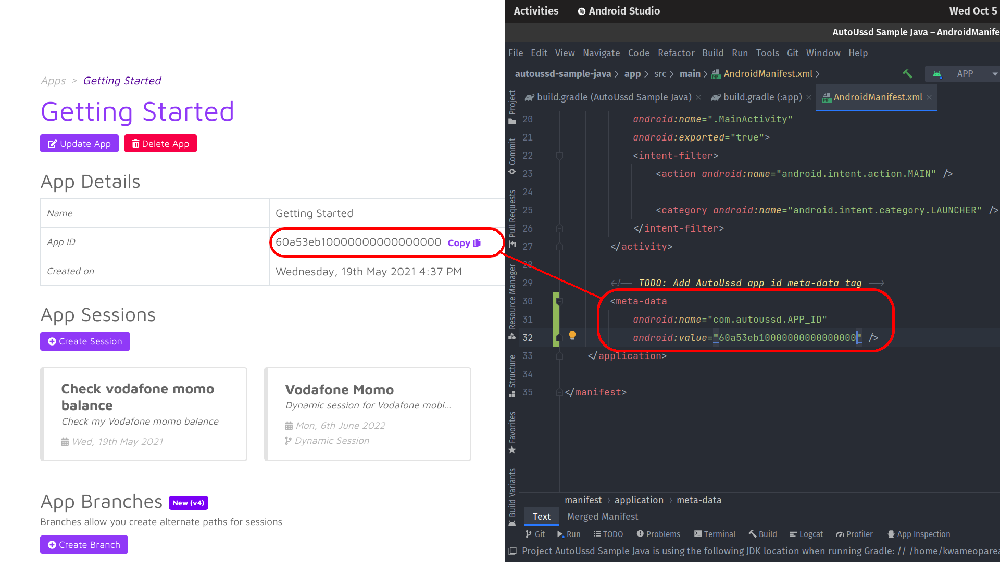
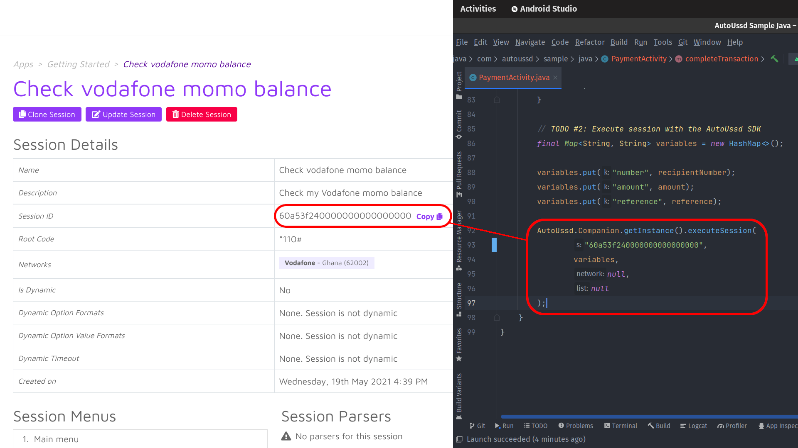

[Home](./README.md)

# Build A Sample App - Android (Java)

In the [Build a Sample App - Setup](./06.Build-Sample-App-Setup) guide, we setup
an app on our dashboard and a session to send money from a Vodafone mobile money
account to another.

In this guide, we’ll build a sample Android app using **Java** which will
utilize our session.

## Requirements

1. Android Studio 4.0 or higher
2. Gradle 7.1.3 or higher
3. Android `minSdkVersion` of **26** or higher
4. Android `compileSdkVersion` of **31** or higher

## Clone the sample starter app

To get started, clone the sample starter app using the command below

```shell
git clone https://github.com/autoussd/autoussd-sample-java.git
```

## Install AutoUssd as a dependency

Next, we'll install the SDK in our cloned starter app

1. Open the **project level** `build.gradle` file and add the following to
   the `allprojects` block

```groovy
allprojects {
  repositories {
    ...
    /* TODO: Add AutoUssd Maven repository */
    maven { url "https://raw.github.com/autoussd/autoussd-aar/master" }
    
    /* or (For the No SMS version) */
    // maven { url "https://raw.github.com/autoussd/autoussd-aar-no-sms/master" }
  }
}
```

2. Open the **app level** `build.gradle` file and add the following to
   the `dependencies` block

```groovy
dependencies {
  ...
  /* TODO: Add AutoUssd dependency */
  implementation 'com.autoussd:autoussd-sdk:4.2.0'
}
```

3. Sync your project with Gradle to download the dependencies
4. Test if everything is working correctly by running the app either on a
   physical device or on the Android emulator. If all is well, you should get an
   interface similar to this


## Configure the `AndroidManifest.xml`

Now, we’ll now configure the `AndroidManifest.xml` to retrieve the sessions in
our app on our dashboard

1. Copy your **app id** from your app in your dashboard

2. Add a `<meta-data/>` tag in the `AndroidManifest.xml` and paste your **app
   id** as its value

```xml

<application>
    ...

    <!-- TODO: Add AutoUssd app id meta-data tag -->
    <meta-data
            android:name="com.autoussd.APP_ID"
            android:value="YOUR APP ID"
    />
</application>
```



## Setup the `PaymentActivity.java` activity

The last thing to do is to invoke the SDK to execute our session.

1. Copy and replace the `PaymentActivity.java` with the following code block

```java
package com.autoussd.sample.java;

import android.os.Bundle;
import android.util.Log;
import android.view.View;
import android.widget.EditText;
import android.widget.Toast;

import androidx.appcompat.app.AppCompatActivity;

import com.autoussd.AutoUssd;

import java.util.HashMap;
import java.util.Map;

public class PaymentActivity extends AppCompatActivity {
    private static final String TAG = "PaymentActivity";

    private final String RESULT_CALLBACK_KEY = "result-callback-key";

    @Override
    protected void onCreate(Bundle savedInstanceState) {
        super.onCreate(savedInstanceState);
        setContentView(R.layout.activity_payment);

        // TODO #1: Initialize AutoUssd
        AutoUssd.Companion.init(this);

        AutoUssd.Companion.getInstance().registerSessionResultListener(RESULT_CALLBACK_KEY, result -> {
            switch (result.getStatus()) {
                case COMPLETED:
                    Log.d(TAG, "Completed");
                    break;
                case PARSED:
                    Log.d(TAG, "Parsed");
                    break;
                case INVALID_SESSION:
                    Log.d(TAG, "Invalid session Id");
                    break;
                case UNSUPPORTED_SIM:
                    Log.d(TAG, "Unsupported SIM");
                    break;
                case SESSION_TIMEOUT:
                    Log.d(TAG, "Session timed-out");
                    break;
                case MENU_CONTENT_MISMATCH:
                    Log.d(TAG, "USSD content did not match menu content");
                    break;
                case ACCOUNT_SUBSCRIPTION_EXPIRED:
                    Log.d(TAG, "Account subscription expired");
                    break;
                case UNKNOWN_ERROR:
                    Log.d(TAG, "Unknown error occurred");
                    break;
            }
        });
    }

    @Override
    public void onDestroy() {
        super.onDestroy();

        // TODO #3: Dispose AutoUssd SDK
        AutoUssd.Companion.getInstance().unregisterSessionResultListener(RESULT_CALLBACK_KEY);
        AutoUssd.Companion.getInstance().dispose();
    }

    public void completeTransaction(View v) {
        // Get references to the EditText components in the view
        EditText recipientNumberInput = findViewById(R.id.numberInput);
        EditText amountInput = findViewById(R.id.amountInput);
        EditText referenceInput = findViewById(R.id.referenceInput);

        // Get the recipient number, amount and reference from the EditText components
        String recipientNumber = recipientNumberInput.getText().toString();
        String amount = amountInput.getText().toString();
        String reference = referenceInput.getText().toString();

        // Check if any of the values are empty and display a toast message if so
        if (recipientNumber.isEmpty() || amount.isEmpty() || reference.isEmpty()) {
            Toast.makeText(this, "All fields are required", Toast.LENGTH_LONG).show();
            return;
        }

        // TODO #2: Execute session with the AutoUssd SDK
        final Map<String, String> variables = new HashMap<>();

        variables.put("number", recipientNumber);
        variables.put("amount", amount);
        variables.put("reference", reference);

        AutoUssd.Companion.getInstance().executeSession(
                "60a53f240000000000000000",
                variables,
                null,
                null
        );
    }
}
```

2. Copy your **session id** from your session in your dashboard and paste in
   the `completeTransaction` method



## For The Laid Back Devs

If you'd rather not go through the tutorial and examples, you can checkout
the `sdk-testing` branch which contains the full implementation of AutoUssd.
Check it out using the command

```bash
git checkout sdk-testing
```

## Testing

Awesome, we’ve finished our setup. Our app should now be able to execute our
session to transfer money from a Vodafone account to another via Vodafone Cash.

A few things to consider:

1. This guide works for a **Vodafone cash enabled SIM card**. If you use another
   networks, modify the guide where necessary.
2. You’ll need an internet connection for the first run. This allows the SDK to
   download the app and session configuration from the web platform.
3. **The app will transfer actual money to the specified recipient number, so
   use caution**

Now let’s run our app and test it.


## Conclusion

Yaaay 🎉🎉🎉! You’ve reached the end of this guide and have built your first app
using AutoUssd!

You’ve just scratched the surface of how you can use USSD session automation in
Android apps. Whether building apps for personal use or commercial use, the
possibilities are endless. We’d love to see the many awesome ways you will use
AutoUssd 😊.

If you encounter any problems, kindly open an issue on
our [Github Issues](https://github.com/autoussd/autoussd-aar/issues) page and
we’ll respond swiftly to them. Now go and create the next big thing!


---

Back: [Build a Sample App - Platform Selection](./07.Build-Sample-App-Platforms.md)
Next Up: [Interpreting the SDK Result](09.Interpreting-SDK-Result.md)
