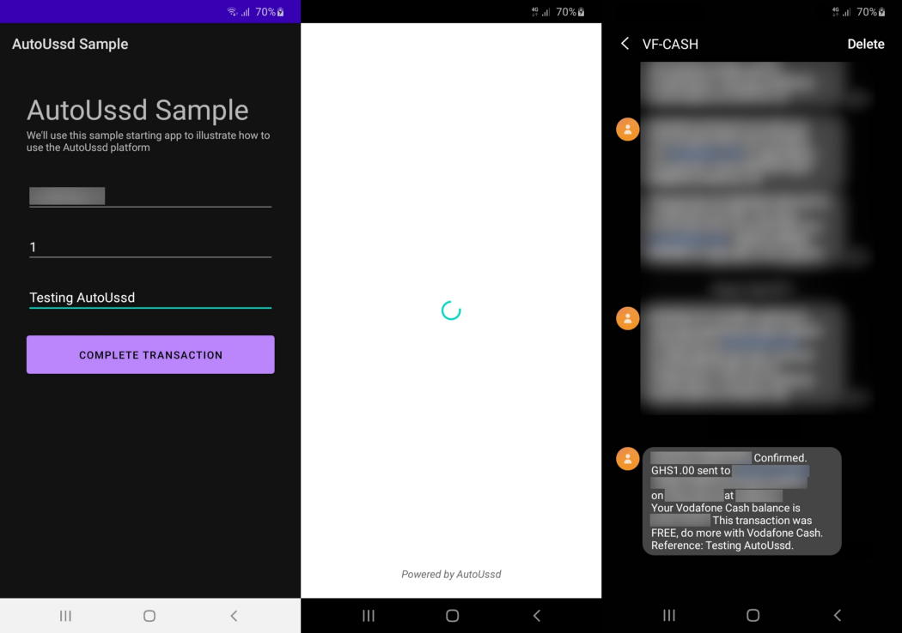

[Home](./README.md)

# Build A Sample App - Flutter

In the [Build a Sample App - Setup](./06.Build-Sample-App-Setup) guide, we setup
an app on our dashboard and a session to send money from a Vodafone mobile money
account to another.

In this guide, we’ll build a sample Android app using **Flutter** which will
utilize our session.

## Requirements

1. Android Studio 4.0 or higher or VS Code
2. Flutter 2.5.3 or higher
3. Gradle 7.1.3 or higher
4. Kotline Gradle Plugin 1.6.21 or higher
5. Android `minSdkVersion` of **26** or higher
6. Android `compileSdkVersion` of **31** or higher

## Clone the sample starter app

To get started, clone the sample starter app using the command below

```shell
git clone https://github.com/autoussd/autoussd-sample-flutter.git
```

## Install AutoUssd as a dependency

Next, we'll install the SDK in our cloned starter app

1. Open your terminal and run the following command

```sh
flutter pub add autoussdflutter
```

2. Test if the everything is working correctly by running the app either on a
   physical device or on the Android emulator. If all is well, you should get an
   interface similar to this:


## Configure `MainActivity.kt`

AutoUssdFlutter uses the
new [AndroidX Activity Result APIs](https://developer.android.com/training/basics/intents/result#kotlin)
which means your `MainActivity` must inherit from
a [ComponentActivity](https://developer.android.com/reference/androidx/activity/ComponentActivity) **
or a sub-class of it**. Follow the steps below to modify your `MainActivity`
accordingly:

1. Open your `MainActivity.kt` in the Android module of your Flutter app. If
   your package name is `com.example.product`, your `MainActivity.kt` will be
   located at:

```shell
<PROJECT_ROOT>/android/app/src/kotlin/com/example/product/MainActivity.kt
```

2. Your file should look like the sample below:

```kotlin
package com.example.product

import io.flutter.embedding.android.FlutterActivity

class MainActivity: FlutterActivity() {
}
```

3. Change your `MainActivity.kt` to look like this

```kotlin
package com.example.product

import io.flutter.embedding.android.FlutterFragmentActivity

class MainActivity: FlutterFragmentActivity()
```

## Setup the `AndroidManifest.xml`

Now, we’ll now configure the `AndroidManifest.xml` of the Android component of
our app to retrieve the sessions in our app on our dashboard

1. Copy your **app id** from your app in your dashboard

2. Add a `<meta-data/>` tag in the `AndroidManifest.xml` and paste your **app
   id** as its value

```xml
<application>
  ...
    
  <!-- TODO: Add AutoUssd app id meta-data tag -->
  <meta-data 
    android:name="com.autoussd.APP_ID" 
    android:value="YOUR APP ID"
  />
</application>
```


## Setup `main.dart`

The last thing to do is to invoke the SDK to execute our session.

The `main.dart` code is quite long, so we'll just be replacing the
following `TODO` statements with sample code for sake of brevity.

1. **Initialize AutoUssd SDK**

```dart
void main() {
  // TODO #1: Initialize WidgetsFlutterBinding

  runApp(const MyApp());
}
```

```dart
void main() {
  // TODO #1: Initialize WidgetsFlutterBinding
  WidgetsFlutterBinding.ensureInitialized();

  runApp(const MyApp());
}
```

2. **Setup AutoUssd SDK callbacks**

```dart
_MyHomePageState() {
  // TODO #2: Setup AutoUssd callbacks
}
```

```dart
_MyHomePageState() {
  // TODO #2: Setup AutoUssd callbacks
  AutoUssdFlutter.getInstance().onSessionCount((count) {
    debugPrint("Session count: $count");
  });

  AutoUssdFlutter.getInstance().onSessionResult((result) {
    debugPrint(result.status.toString());

    if (result.status == ResultStatus.COMPLETED) {
      Future.microtask(() {
        showDialog(
          context: context,
          builder: (context) {
            return AlertDialog(
              content: Text(
                result.lastContent ?? "Please wait for a confirmation message",
              ),
              actions: [
                TextButton(
                  onPressed: () {
                    Navigator.of(context).pop();
                  },
                  child: Text("Ok"),
                ),
              ],
            );
          },
        );
      });
    }
  });
}
```

3. **Execute session in the `completeTransaction` function**

```dart
void completeTransaction(BuildContext context) {
  if (_formKey.currentState!.saveAndValidate()) {
    final values = _formKey.currentState!.value;
    final number = values["recipientNumber"] as String;
    final amount = int.tryParse(values["amount"]) ?? 0;
    final reference = values["reference"] as String;

    // TODO #3: Execute session with the AutoUssd SDK
  }
}
```

```dart
void completeTransaction(BuildContext context) {
  if (_formKey.currentState!.saveAndValidate()) {
    final values = _formKey.currentState!.value;
    final number = values["recipientNumber"] as String;
    final amount = int.tryParse(values["amount"]) ?? 0;
    final reference = values["reference"] as String;

    // TODO #3: Execute session with the AutoUssd SDK
    AutoUssdFlutter.getInstance().executeSession(
      "623455ec64e7d7e68f353334",
      {
        "number": number,
        "amount": amount.toString(),
        "reference": reference,
      },
    );
  }
}
```

## For The Laid Back Devs

If you'd rather not go through the tutorial and examples, you can checkout
the `sdk-testing` branch which contains the full implementation of AutoUssd.
Check it out using the command

```bash
git checkout sdk-testing
```

## Testing

Awesome, we’ve finished our setup. Our app should now be able to execute our
session to transfer money from a Vodafone account to another via Vodafone Cash.

A few things to consider

1. This guide works for a **Vodafone cash enabled SIM card**. If you use another
   networks, modify the guide where necessary.
2. You’ll need an internet connection for the first run. This allows the SDK to
   download the app and session configuration from the web platform.
3. **The app will transfer actual money to the specified recipient number, so
   use caution**

Now let’s run our app and test it.



## Conclusion

Yaaay 🎉🎉🎉! You’ve reached the end of this guide and have built your first app
using AutoUssd!

You’ve just scratched the surface of how you can use USSD session automation in
Android apps. Whether building apps for personal use or commercial use, the
possibilities are endless. We’d love to see the many awesome ways you will use
AutoUssd 😊.

If you encounter any problems, kindly open an issue on
our [Github Issues](https://github.com/autoussd/autoussd-aar/issues) page and
we’ll respond swiftly to them. Now go and create the next big thing!


---

Back: [Build a Sample App - Platform Selection](./07.Build-Sample-App-Platforms.md)
Next Up: [Interpreting the SDK Result](09.Interpreting-SDK-Result.md)
