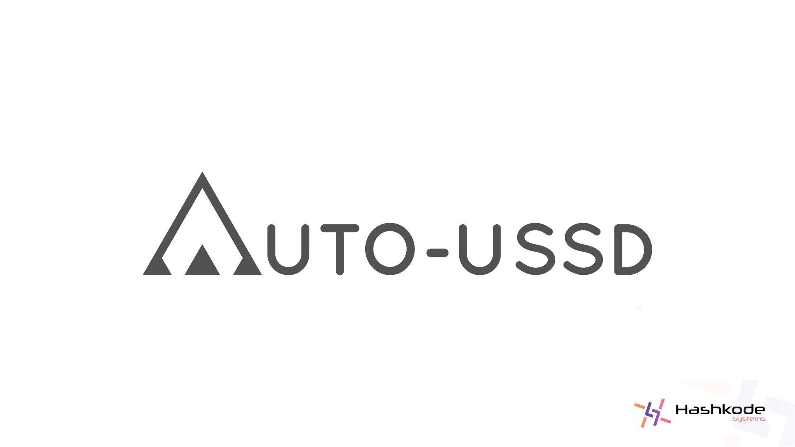

# AutoUssd Documentation

     

[AutoUssd](https://autoussd.com) is a powerful USSD automation SDK for **Android** and **Flutter (Android)** which allows you to build apps on top of USSD services.

## Table Of Contents

1. [Terminology](./01.Terminology.md)
2. [Sessions](./02.Sessions.md)
3. [Menus](./03.Menus.md)
4. [SMS Parsers](./04.Parsers.md)
5. [Branches - **New (v4)**](./05.Branches.md)
6. [Build A Sample App - Setup](./06.Build-Sample-App-Setup.md)
7. [Build A Sample App - Platform Selection](./07.Build-Sample-App-Platforms.md)
8. Build A Sample App - Implementation
   1. [Build A Sample App - Android](./08.Build-Sample-App-Android.md)
   3. [Build A Sample App - Flutter](./08.Build-Sample-App-Flutter.md)
9. [Interpreting the SDK result](./09.Interpreting-SDK-Result.md)
10. [Android Permissions](10.Android-Permissions.md)
11. [Class Reference](11.Class-Reference.md)
12. [Changelog](12.Changelog.md)

